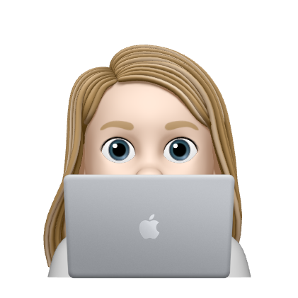

# My Program

Does things
    
It helps people do things. In the future, I'd like it to help people do stuff.

## Table of Contents
* [Installation](#installation)
* [Instructions for Use](#instructions-for-use)
* [Credits](#credits)
* [License](#license)
    
## Installation
1. This program requires the following programs be installed:<ul><li>this</li><li>that</li><li>the other</li></ul>

2. Before running this program, please have the following information on hand and / or loaded into your 'asset/images' folder:<ul><li>one thing</li><li>two things</li><li>three things</li></ul>

## Instructions for Use
<ol><li>step one</li><li>step two</li></ol>

Here is a [video walkthrough](https://drive.google.com/file/d/1sjyWGV4-m1sxlEh5_PL5DjmNXSEW6Rys/view?usp=sharing).

## Credits 

- [@BUButtercup](https://github.com/BUButtercup): 

  - wrote code

- [Awesome Tutorial](www.beingawesome.fake)

  -was awesome

## License
The files in this repository are covered by the [MIT License](https://choosealicense.com/licenses/mit/).
