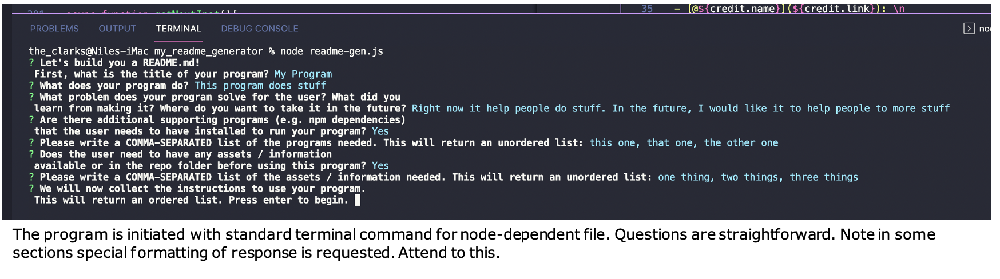
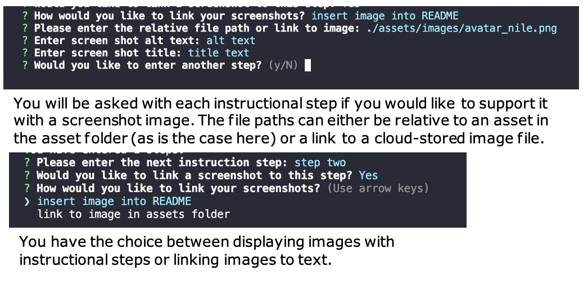
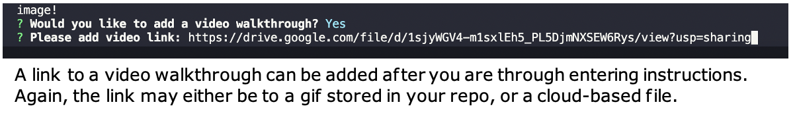

# README.md Generator

This program accepts user input about their repository and generates a basic README.md file formatted in [GitHub Flavored Markdown]( https://github.github.com/gfm/) for them to add to their repos. The sections covered include: <ul><li>Title</li><li>Introductory section that covers: </li><ul><li>Description of the program</li><li>Problem the program solves</li></ul><li>Installation instructions</li><li>Instructions for Use</li><li>Credits</li><li>License</li>
    
This program provides a basic interactive template for creating a README.md file, eliminating the need to continually start over from scratch whenever you need to create one and ensuring that you are at least covering the basic information expected. <strong>This README.md was generated using this program and some custom formatting in my input responses. To see an example of a basic README.md generated using this program, check out [this file]()!</strong>

## Table of Contents
* [Installation](#installation)
* [Instructions for Use](#instructions-for-use)

* [License](#license)
    
## Installation
1. This program requires the following programs be installed:<ul><li>node</li><li>npm inquirer</li></ul>

2. Before running this program, please have the following information on hand and / or loaded into your 'asset/images' folder:<ul><li>Have any desired screenshots or video clips either uploaded to repos w/ relative file paths prepared or links to externally-stored items ready</li><li>Have the GitHub username & profile link of any contributors handy (or titles and links to any resources/tutorials used)</li><li>Know which type of license you want to apply to your program (if you are unsure you can visit [this site](https://choosealicense.com/licenses/) to read about the types of license offered as options in this program</li><li><strong>Recommended Prep:</strong><ul><li>Save your screenshots w/ names that include a reference to the instructional step they correspond with: this will make them easier to pair when you’re entering the file paths.</li><li>Put some thought into what you want to say in each section (maybe even pre-type and spellcheck for cutting and pasting?): this will make moving through the program much smoother.</li><li>Think about the visual presentation of the text you’re going for: if you do nothing to customize it this program outputs a GFM file with basic formatting. You can use Markdown syntax and HTML tags that are supported by GFM to style your input if you want! Select the “Display the source blob” button in the top right corner to see what I used.</li><li> <strong> NOTE: Any section of this program that specifies it will return a <em>list</em> will not render all Markdown syntax if it is used in your input. It will accept HTML tags though!<strong></li><li><strong> SECOND NOTE: Please pay special attention to any <em>formatting</em> requests that are made by these list-creation questions. It’s important to follow the rules!</strong></li><li><strong> FINAL NOTE: Don’t panic! If you make a mistake in your entries or exclude something you meant to include it is very easy to edit or add to the final product. Open the file up in your repos click the edit pencil and type away! Here’s a link to a great [resource](https://docs.github.com/en/get-started/writing-on-github/getting-started-with-writing-and-formatting-on-github/basic-writing-and-formatting-syntax) for GitHub Markdown syntax.</strong></li></li></ul>

## Instructions for Use
<ol><li>These instructions will walk you through the process of creating a <strong>basic README.md</strong>. While additional custom formatting is possible by inserting tags and symbols into your input, this is not required to put out a decent file that gets the point across.</li><li>Ensure that you have all of the recommended prep items covered and have the required programs/packages downloaded. </li><li>Clone down the repos, open it in your code editor, and open the integrated terminal at the level of the readme-gen.js file. This will make it very easy to access and move the finished README.md file when it is rendered.</li><li>Begin the program with the terminal command `node readme-gen.js`. You will be asked for a series of responses. These will be much easier to input if you have them prepared in advance.</li><li>Please follow any directions with regards to special formatting. There are two instances where you are asked to enter a COMMA-SEPARATED LIST of items. If you don’t follow the directions, your list will not render as you intended, and you will need to edit the file further after it is returned to you.</li><li>When you get to entering your instructions for use, after every step you will be given the opportunity to link a screen shot if needed. You will have the option of either inserting it to be displayed directly in the file or linking it to text to be displayed on-click. Choose whichever works best for you. Please enter file paths without surrounding single or double quotation marks. <strong>Note: you can control the size of images displayed in the README.md itself by opening the file and editing the width attribute of the HTML image tag.</strong></li><li>After inputting your instructions, you will be given the opportunity to add a link to a video walkthrough (either uploaded GIF or externally stored file link). This will display at the bottom. Again, please enter file paths without surrounding single or double quotation marks.</li><li>The next section is where you add any credits you need to display. If you enter the GitHub name and profile link of your collaborators, it will be listed with a clickable link in the “Credits” section. If you choose to input nothing, this section will not render at all.: <a href="./assets/images/RG_step-8.png">Credits Info Entry</a></li><li>Lastly, you will be asked to choose which license you want to apply to your program. You are given a list of choices, all of which you can review at the link given at the beginning of this file if you need to. When rendered, the text specifying the license will be a link to the page describing that particular license. If you don’t want to use any of those listed, you can always go into the rendered file and make alterations as needed.</li><li>Once you have answered the last question, your README.md file will be rendered in the same folder that the readme-gen.js file is in. At this point, you can copy / move it to your own program’s repo. If edits are needed you can either edit it in your code editor, or edit it once you have it in your GitHub repos. [Here’s an example output]().: <a href="./assets/images/RG_step-10.png">How to Move File</a></li><li>Please watch the video walkthrough to see it in action!</li></ol>

Here is a [video walkthrough](https://drive.google.com/file/d/136VK0Qq_d8XHih5a-RDTc3dLtneHH5My/view?usp=sharing).

## License
The files in this repository are covered by the [MIT License](https://choosealicense.com/licenses/mit/).
