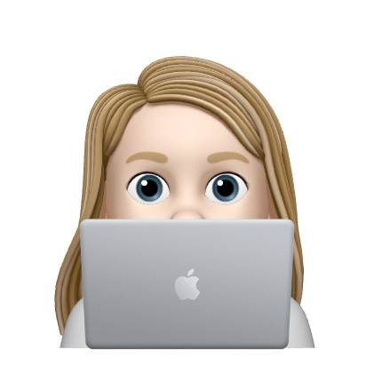

# My Program

Does Stuff
    
It helps the user do stuff.

## Table of Contents
* [Installation](#installation)
* [Instructions for Use](#instructions-for-use)
* [Credits](#credits)
* [License](#license)
    
## Installation
1. This program requires the following programs be installed:<ul><li>this thing</li><li>that thing</li></ul>

2. Before running this program, please have the following information on hand and / or loaded into your 'asset/images' folder:<ul><li>that thing</li><li>the other one</li></ul>

## Instructions for Use
<ol><li>This step is the first one.</li><li>Step two is a fun one.</li><li>Step three is the best one.</li></ol>

Here is a [video walkthrough]().

## Credits 

- [@BUButtercup](fakelink.fake): 

  - helped write the code

## License
The files in this repository are covered by the [MIT License](https://choosealicense.com/licenses/mit/).
